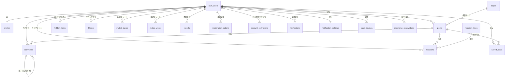

# スキーマ定義

更新日：2026-09-29。Issue #9として[データ設計案](データ設計案.md)・[バックエンド設計](バックエンド設計.md)・[未決事項](未決事項.md)の決定済み要件を具体化した、テーブル定義の一次資料。**本書のテーブル名・カラム名・型は実装時の名称とする**（データ設計案は経緯と論点の記録として残す）。マイグレーションSQLの作成は#10で行う。

型はPostgreSQL（Supabase）を前提とする。すべてのテーブルは`created_at timestamptz not null default now()`を持つ（記載省略）。主キーは特記なき限り`id uuid primary key default gen_random_uuid()`。

## 1. ER概要

`auth_users`はSupabase Authが管理する`auth.users`を指す。アプリ側のテーブルからは`references auth.users(id)`で参照し、本書では省略して`user_id`とだけ記載する。

## 2. プロフィール・ニックネーム

### profiles

| カラム | 型 | 制約・備考 |
|---|---|---|
| id | uuid | PK、`references auth.users(id) on delete cascade` |
| nickname | text | 表示用。2〜12文字（絵文字等は1文字として数える。文字数チェックはEdge Function側でNFKC正規化＋グラフェムクラスタ単位に行い、DBは`char_length(nickname) between 1 and 24`程度の緩い上限のみ持つ） |
| normalized_nickname | text | 一意判定用。NFKC正規化＋大文字小文字統一＋前後空白除去した値。`unique`制約 |
| icon_key | text | 用意されたイラストから選択（マスタは[未決事項](未決事項.md)参照。初期版確定までは自由入力のkeyとして保持） |
| bio | text | 任意、100文字まで |
| child_age_range | text | 任意。選択肢は未決定のためテキストで保持し、確定後にenum化を検討 |
| updated_at | timestamptz | 編集のたびに更新 |

**決定済み**：本名・住所・電話番号・子どもの名前は収集しない。プロフィール本文（bio・child_age_range）はログイン必須、nicknameのみ投稿上で公開表示する（[バックエンド設計](バックエンド設計.md)2節）。

**設計案**：`normalized_nickname`はDBトリガー（`before insert or update`）で`nickname`から自動生成し、アプリ側の計算とズレないようにする。正規化アルゴリズム（NFKC適用範囲、絵文字の扱い）はEdge Function・トリガーの実装時に確定する。

### nickname_reservations

| カラム | 型 | 制約・備考 |
|---|---|---|
| normalized_nickname | text | PK |
| reserved_until | timestamptz | 変更・退会から30日後 |
| previous_owner_id | uuid | 元の利用者。退会時はauth.usersの削除後も残すため`on delete set null`は使わず、退会処理内でこの値を保持したままauth.usersのみ削除する運用とする |
| reason | text | `changed`（ニックネーム変更）／`withdrawn`（退会） |

**決定済み**：予約期間中は他者が同じ`normalized_nickname`を使用できないが、`previous_owner_id`本人は再利用できる（[未決事項](未決事項.md)反映済み）。

**設計案**：ニックネーム変更・登録時は`profiles`の一意制約チェックに加えて、`nickname_reservations`に他者予約が有効（`reserved_until > now()`）でないかを確認する。本人が同じ名前へ「変更」した場合は新規予約を作らない。

## 3. 投稿・コメント・話題

### topics

| カラム | 型 | 制約・備考 |
|---|---|---|
| id | smallint | PK |
| label | text | 運営が用意する話題名 |
| sort_order | smallint | 表示順 |
| is_active | boolean | 選択肢からの除外に使う（削除せず非表示） |

初期の選択肢は未決定（[未決事項](未決事項.md)「マスタ選択肢の初期版」）。確定後に`supabase/seed.sql`へ反映する。

### posts

| カラム | 型 | 制約・備考 |
|---|---|---|
| id | uuid | PK |
| author_id | uuid | `references auth.users(id)` |
| post_type | text | `check (post_type in ('guchi','soudan','kotsu'))`（ぐち／相談／コツ・体験談） |
| topic_id | smallint | `references topics(id)`、null可（任意で1つ） |
| body | text | 1,000文字まで。`check (char_length(body) between 1 and 1000)` |
| reaction_mode | text | `check (reaction_mode in ('quiet_support','want_comments'))`。初期値`quiet_support`（ただ聞いてほしい） |
| comment_acceptance | text | `check (comment_acceptance in ('open','closed'))`。`reaction_mode='want_comments'`のときのみ意味を持つ |
| hidden_at | timestamptz | 通報による自動一時非表示。nullなら非表示でない |
| updated_at | timestamptz | 編集のたびに更新 |

**決定済み**：投稿種類・話題は決定済み（[バックエンド設計](バックエンド設計.md)3節）。`reaction_mode`は相互に変更可能、`comment_acceptance`は`want_comments`のときのみ`open`⇄`closed`を切り替える。投稿削除時は`comments`・`reactions`・`saved_posts`の関連行を`on delete cascade`で削除する。

**設計案**：`hidden_at`が設定された投稿は一般利用者・未ログイン利用者からのSELECTを公開ビュー・RLSで除外する。運営者は`hidden_at`の有無に関わらず参照できる。

### comments

| カラム | 型 | 制約・備考 |
|---|---|---|
| id | uuid | PK |
| post_id | uuid | `references posts(id) on delete cascade` |
| author_id | uuid | `references auth.users(id)` |
| parent_comment_id | uuid | `references comments(id) on delete cascade`、null可 |
| body | text | 500文字まで。削除済みの場合はnull |
| deleted_at | timestamptz | 本人削除時に設定。null以外なら「削除済み」として表示しbodyを返さない |
| hidden_at | timestamptz | 通報による自動一時非表示、または親投稿の一時非表示に連動 |
| updated_at | timestamptz | 編集のたびに更新（「編集済み」表示の判定に使用） |

**決定済み**：返信は1段階のみ（[バックエンド設計](バックエンド設計.md)3節）。表示順は`created_at asc`、返信は対象コメントの下に表示する。親コメント削除時は本文を「削除済み」として扱い、返信は残す。削除済み・一時非表示のコメントは公開コメント件数に含めない。

**設計案**：`parent_comment_id`が指すコメントの`post_id`が自分自身の`post_id`と一致すること、および指すコメント自身の`parent_comment_id`がnull（＝返信への返信を禁止）であることを、`before insert`トリガーで検証する（Postgresの標準FK制約だけでは表現できないため）。コメント削除は物理削除ではなく`deleted_at`を設定するソフト削除とし、`body`をnullへ更新する（削除時点の本文を保持しない）。

## 4. リアクション

### reaction_types

| カラム | 型 | 制約・備考 |
|---|---|---|
| id | smallint | PK |
| label | text | 運営が用意する定型文（5〜8種） |
| sort_order | smallint | 表示順 |
| is_active | boolean | 選択肢からの除外に使う |

### reactions

| カラム | 型 | 制約・備考 |
|---|---|---|
| post_id | uuid | `references posts(id) on delete cascade` |
| user_id | uuid | `references auth.users(id)` |
| reaction_type_id | smallint | `references reaction_types(id)` |
| updated_at | timestamptz | 変更のたびに更新 |

主キーは`(post_id, user_id)`の複合PK。

**決定済み**：共感ボタンと定型文は1つのリアクションに統一済み（[バックエンド設計](バックエンド設計.md)2節）。ログイン必須、1投稿1人1つで変更・取消可能、コメント受付終了後も利用可能。件数は投稿者のみ閲覧可。

**設計案**：登録は`insert ... on conflict (post_id, user_id) do update set reaction_type_id = excluded.reaction_type_id, updated_at = now()`で変更を一操作にする。取消は行の削除。

## 5. 保存・非表示・ブロック・ミュート

### saved_posts

| カラム | 型 | 制約・備考 |
|---|---|---|
| user_id | uuid | `references auth.users(id)` |
| post_id | uuid | `references posts(id) on delete cascade` |

複合PK`(user_id, post_id)`。他者へ保存数・保存した事実を公開しない。

### hidden_items

| カラム | 型 | 制約・備考 |
|---|---|---|
| user_id | uuid | `references auth.users(id)` |
| target_type | text | `check (target_type in ('post','comment'))` |
| target_id | uuid | 対象のid（`posts`または`comments`への論理参照。型ごとにFKを分けるのが難しいためアプリ層で整合性を保証する） |

複合PK`(user_id, target_type, target_id)`。**本人だけに**非表示にする機能で、運営の一時非表示（`hidden_at`）とは独立に扱う。

### blocks

| カラム | 型 | 制約・備考 |
|---|---|---|
| blocker_id | uuid | `references auth.users(id)` |
| blocked_id | uuid | `references auth.users(id)`、`check (blocker_id <> blocked_id)` |

複合PK`(blocker_id, blocked_id)`。**決定済み**：ブロックすると相手の投稿・コメント・返信が自分に表示されず、相手は自分の投稿・コメントへコメント・返信・共感できない。相手には通知しない。

### muted_topics / muted_words

| テーブル | カラム | 備考 |
|---|---|---|
| muted_topics | user_id, topic_id | 複合PK。`references topics(id)` |
| muted_words | user_id, word | 複合PK`(user_id, lower(word))`相当の一意性。上限件数は未決定（[未決事項](未決事項.md)） |

## 6. 通報・運営操作・利用制限

### reports

| カラム | 型 | 制約・備考 |
|---|---|---|
| id | uuid | PK |
| reporter_id | uuid | `references auth.users(id)` |
| target_type | text | `check (target_type in ('post','comment'))` |
| target_id | uuid | 論理参照（削除後も記録を残すため物理FKを張らない） |
| reason | text | 通報理由（6種、Notion決定ログ参照） |
| detail | text | 補足、任意 |
| resolved_at | timestamptz | 運営が再表示・削除等で対処した日時。nullは未対応 |
| resolved_by | uuid | 対処した運営者 |

**決定済み**：同一通報者・同一対象の通報は1件に集約する。運営が対処（`resolved_at`設定）した後は、その通報群を「3人到達」の自動非表示判定に再カウントしない。

**設計案**：一意制約は`unique (reporter_id, target_type, target_id) where resolved_at is null`という部分unique indexにする。これにより、対処済みの通報が残っていても、対処後に同じ通報者が新たに通報し直せる（過去の対処済み行とは別の未対応行として扱う）。自動一時非表示は「`target_type`・`target_id`が一致し`resolved_at is null`である行」を`reporter_id`でdistinctカウントし、3人に達したら対象の`hidden_at`を設定するトリガー／DB関数で行う。運営が再表示するときは、対象の`resolved_at is null`な通報をまとめて`resolved_at = now()`に更新する。

### moderation_actions

| カラム | 型 | 制約・備考 |
|---|---|---|
| id | uuid | PK |
| admin_id | uuid | `references auth.users(id)` |
| target_type | text | `check (target_type in ('post','comment'))` |
| target_id | uuid | 論理参照 |
| action | text | `check (action in ('unhide','delete','warn','suspend'))` |
| reason | text | 本人へ通知する理由 |

運営者の全操作を記録する。RLSで運営者のみ書き込み可、参照範囲は[権限表](権限表.md)で定義する。

### account_restrictions

| カラム | 型 | 制約・備考 |
|---|---|---|
| id | uuid | PK |
| user_id | uuid | `references auth.users(id)` |
| stage | smallint | 1=7日間、2=30日間、3=無期限。次の`stage`は当該利用者の過去件数から決定する |
| starts_at | timestamptz | 開始日時 |
| ends_at | timestamptz | 終了予定。`stage=3`（無期限）はnull |
| reason | text | 対処理由 |
| created_by | uuid | 運営者 |
| lifted_at | timestamptz | 異議申立て等による早期解除。運用は未決定（[未決事項](未決事項.md)） |

**決定済み**：利用停止は段階的（初回7日→再発30日→再発以降は無期限）。停止中は新規投稿・コメント・共感・通報を禁止し、既存の投稿・コメントは公開を維持する。

**設計案**：現在有効な制限は`ends_at is null or ends_at > now()`かつ`lifted_at is null`で判定する。新規制限作成時は`select count(*) from account_restrictions where user_id = :id`で次の`stage`を決める（`lifted_at`済みも含めるか、悪質性評価の一部とするかは運用ルールとして別途定める）。

## 7. 通知

### notifications

| カラム | 型 | 制約・備考 |
|---|---|---|
| id | uuid | PK |
| user_id | uuid | 受信者。`references auth.users(id)` |
| notification_type | text | `check (notification_type in ('comment','reply','reaction_digest','moderation'))` |
| actor_id | uuid | 発生させた利用者。集約通知・運営通知はnull |
| post_id | uuid | `references posts(id) on delete cascade`、null可 |
| comment_id | uuid | `references comments(id) on delete cascade`、null可 |
| is_read | boolean | 既定false |

**決定済み**：自由コメントは投稿者へ個別通知、共感はまとめて通知、返信は返信先コメントの投稿者へ通知する（同一人物への重複通知・自分自身への通知はしない）。

**設計案**：重複防止は「同じ`user_id`・`notification_type`・`actor_id`・`comment_id`の未読通知がある場合は新規作成しない」等のアプリ側ロジックで行う。共感の集約通知（`reaction_digest`）は定期ジョブで生成する想定とし、集約頻度は未決定のため#19で確定する。

### notification_settings

| カラム | 型 | 制約・備考 |
|---|---|---|
| user_id | uuid | PK、`references auth.users(id)` |
| comments_enabled | boolean | 既定true |
| replies_enabled | boolean | 既定true |
| reactions_enabled | boolean | 既定true |
| push_enabled | boolean | 既定true |

### push_devices

| カラム | 型 | 制約・備考 |
|---|---|---|
| id | uuid | PK |
| user_id | uuid | `references auth.users(id)` |
| platform | text | `check (platform in ('ios','android'))` |
| device_token | text | `unique` |
| last_seen_at | timestamptz | トークン有効性確認に使用 |

配信サービス（FCM等）の選定は未決定（#19）。

## 8. 運営設定

### app_settings

| カラム | 型 | 制約・備考 |
|---|---|---|
| key | text | PK。例：`signup_rate_limit`, `new_signup_halted`, `post_rate_limit_per_day` |
| value | jsonb | 設定値 |
| updated_by | uuid | 運営者 |
| updated_at | timestamptz | |

**決定済み**：登録直後のレート制限・新規登録停止は固定値でなく本テーブルで運営がトグル・変更できるようにする（[バックエンド設計](バックエンド設計.md)7節）。具体的な既定値は未決定。

## 9. 未確定のまま残す設計判断

- `child_age_range`・`icon_key`・`muted_words`件数上限：マスタ選択肢が未決定のため型を仮置きしている。確定後にenum化・CHECK制約を追加する（[未決事項](未決事項.md)）。
- ニックネーム正規化の具体アルゴリズム：NFKC正規化を軸に置くが、絵文字・結合文字の扱いは実装時に確定する。
- `account_restrictions`の異議申立て・早期解除の運用フロー：`lifted_at`カラムは用意するが、承認プロセスは未決定。
- 通報理由の具体的な6種の値：Notion決定ログの記述を採用予定だが、本書では`reason`をtextとして仮置きしている。実装時にCHECK制約またはマスタテーブル化を検討する。

## 参照

- [データ設計案](データ設計案.md)：経緯・論点の記録
- [バックエンド設計](バックエンド設計.md)
- [権限表](権限表.md)
- [API契約](API契約.md)
- [未決事項](未決事項.md)
